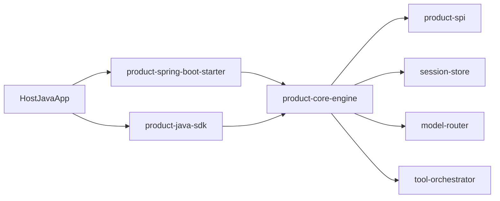

# 缁熶竴鏅鸿兘浣?Jar 浜у搧 - 鏋舵瀯璁捐

## 1. 浜у搧瀹氫綅

鏈」鐩畾浣嶄负鍙祵鍏ュ叾浠?Java 椤圭洰鐨勬櫤鑳戒綋鑳藉姏鍖咃紝鎻愪緵锛?
- `product-java-sdk`锛氱函 Java SDK
- `product-spring-boot-starter`锛歋pring Boot 鑷姩瑁呴厤
- `product-core-engine`锛氬唴宓屾墽琛屽唴鏍?- `product-spi`锛氭ā鍨嬨€佸伐鍏枫€佷細璇濇墿灞曠偣

涓嶅啀浠ョ嫭绔嬪井鏈嶅姟骞冲彴浣滀负涓诲舰鎬併€?
## 2. 鎬讳綋鏋舵瀯

## 3. 妯″潡鑱岃矗

- `product-spi`
  - `ProductModelProvider`
  - `ProductTool`
  - `ProductSessionStore`
- `product-core-engine`
  - 浼氳瘽绠＄悊锛堥粯璁ゅ唴瀛樺疄鐜帮級
  - 閫昏緫妯″瀷璺敱锛堝惈涓诲/鍔犳潈/鍋ュ悍鎰熺煡锛?  - 宸ュ叿鎵ц缂栨帓
- `product-java-sdk`
  - `AgentClient` + `AgentClientBuilder`
  - 榛樿 `openai_compat` provider
- `product-spring-boot-starter`
  - `agent.product.*` 閰嶇疆缁戝畾
  - `AgentClient` 鑷姩娉ㄥ叆

## 4. 鍏抽敭鍘熷垯

- 鍐呭祵浼樺厛锛氫笟鍔¤繘绋嬪唴鐩存帴璋冪敤锛岄檷浣庨儴缃插鏉傚害
- 濂戠害澶嶇敤锛氬鐢?`agent-api` 涓?`model-api`
- 寮€鏀惧皝闂細閫氳繃 SPI 鎵╁睍鍘傚晢鍜屽伐鍏凤紝涓嶆敼鏍稿績
- 鍙紨杩涳細Starter 涓?SDK 琛屼负涓€鑷?
